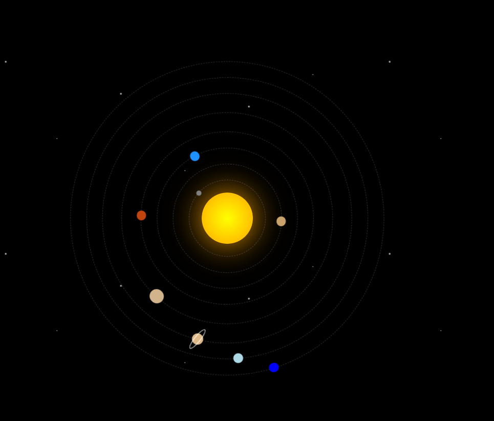

# Solar System Animation

A simple animated Solar System built using HTML and CSS.

## Screenshot

## Features

- Animated planetary orbits
- CSS keyframe animations
- Star background animation
- Saturn ring effect
- Pure HTML and CSS

## Technologies Used

- HTML5
- CSS3

